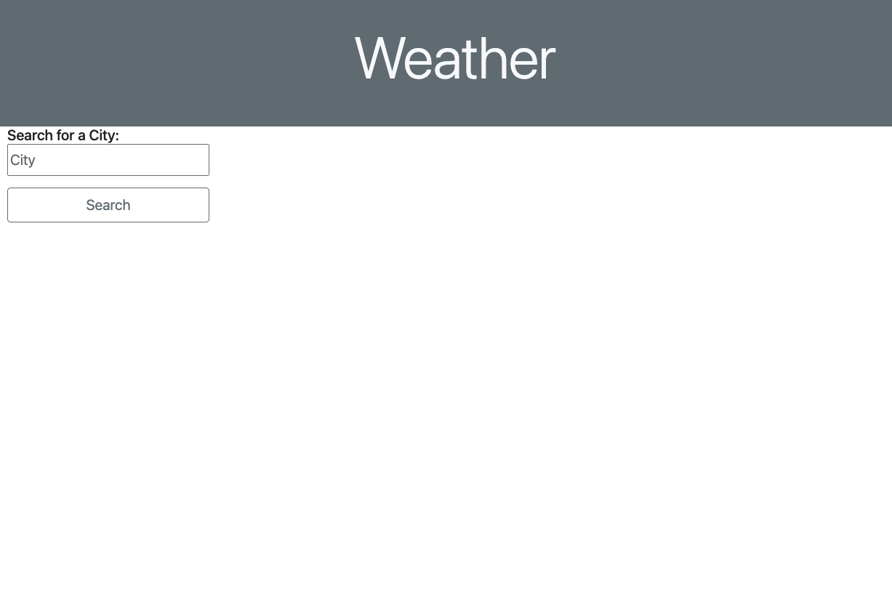
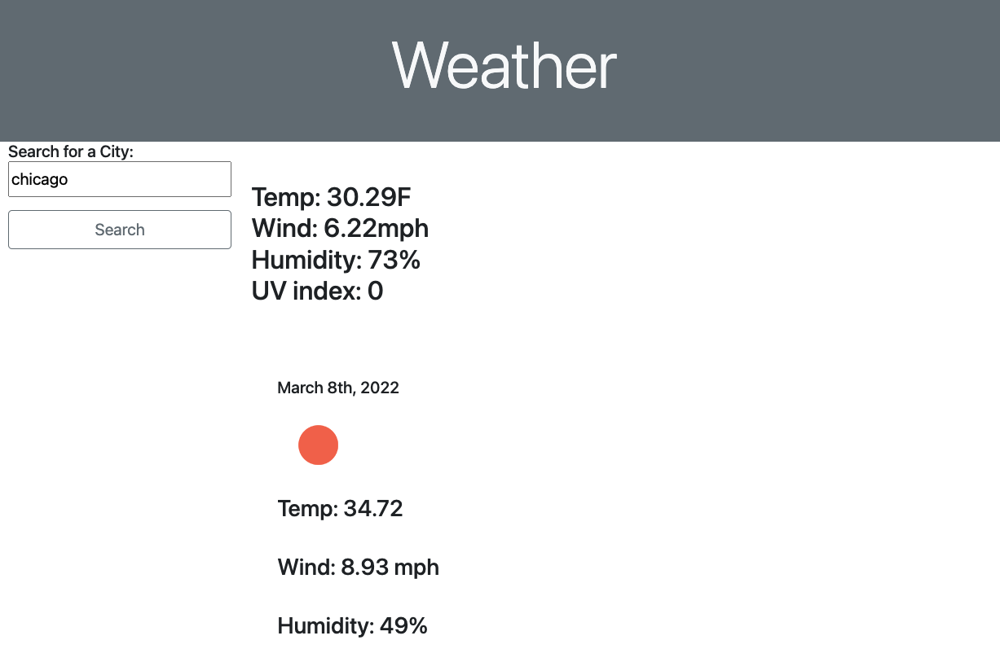

# weather-forecast

                David Aylward

## About

 This webpage will allow you to search for a city by name and it will feed back information about current and upcoming weather. It will tell you important things such as temperature, wind speed, humidity, and current UV index. This is mainly done through the use of the open weather api https://openweathermap.org/api.

## Deployed Link

https://davidayl.github.io/weather-forecast/

## Table Of Contents

1. [Usage](#usage)

2. [Important Code](#important)

3. [Reference Links](#reference)

4. [Visuals](#visuals)

## Usage

This page is mainly intended to be used by consumers and average people scrolling through the web. However this shows the skills needed to properly use an api. When knowing how to properly use an find specific data in an api it is easy to implement it in other ways. Some ways you could implement this api is in a weather app or a local news app. Also you could include a similar functioning page on a local business' webpage.

## Important Code

This project is mainly created through Javascript and then styled using bootstrap. Some of the important code is showcased below.

### Search Button
   
 This function below handles the submit button and sets the searched city into local storage for history. 
        
        var searchHandler = function (event) {
    event.preventDefault()
    console.log('hello')
    var SearchCities = cityInput.value
    if (SearchCities) {
        getUrlName(SearchCities);
        cityInput.value = SearchCities;
        localStorage.setItem('city', JSON.stringify(displayHistory));
    } else {
      alert('uh oh')
    }
    };

### Button Click Eventlisterner

Below is an event listener that is used to detect when the user clicks on the submit button. This then runs the function shown above.

    searchBtn.addEventListener('click', searchHandler);

## Reference Links

### Open Weather API

https://openweathermap.org/api

### MDN Intro to web APIS

https://developer.mozilla.org/en-US/docs/Learn/JavaScript/Client-side_web_APIs/Introduction

### Bootstrap

https://getbootstrap.com/

## Visuals

### Home Page

### Search Results

